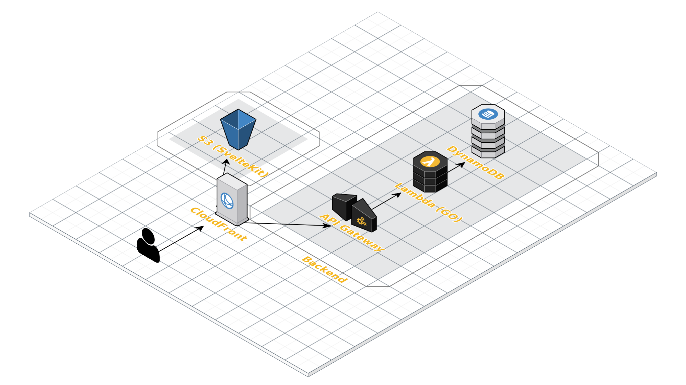

# Picker

## Table of contents
- [Picker](#picker)
  - [Table of contents](#table-of-contents)
  - [Single Table Schema](#single-table-schema)
    - [Entities](#entities)
    - [Access Patterns](#access-patterns)
  - [Architecture](#architecture)
  - [Going Forward](#going-forward)

## Single Table Schema

### Entities
| Entity | PK        | SK               | GSI1PK    | GSI1SK            | type   |
| ------ | --------- | ---------------- | --------- | ----------------- | ------ |
| Room   | ROOM#NAME | ROOM#NAME        | USER#UUID | ROOM#RFC3339#NAME | room   |
| Option | ROOM#NAME | ROOM_OPTION#UUID |           |                   | option |

### Access Patterns
| Access Pattern                                                     | Query                                            |
| ------------------------------------------------------------------ | ------------------------------------------------ |
| Get room by name with all options                                  | PK = ROOM#NAME, begins_with(SK, 'ROOM')          |
| Get all rooms owned by the (current) user ordered by creation date | GSI1PK = USER#UUID, begins_with(GSI1SK, 'ROOM#') |

## Architecture

## Going Forward
- Link a mobile number for recovery of user_id cookie
